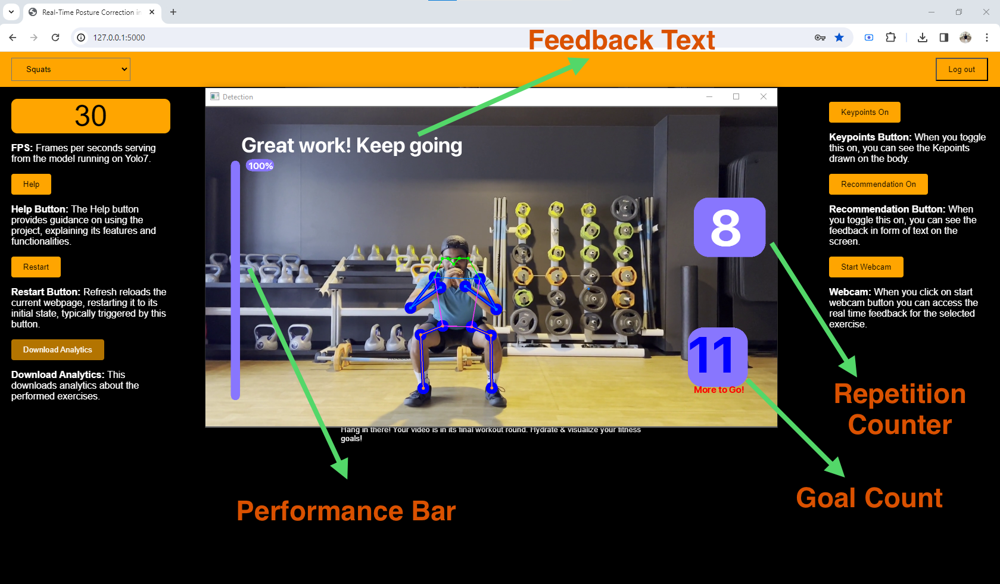
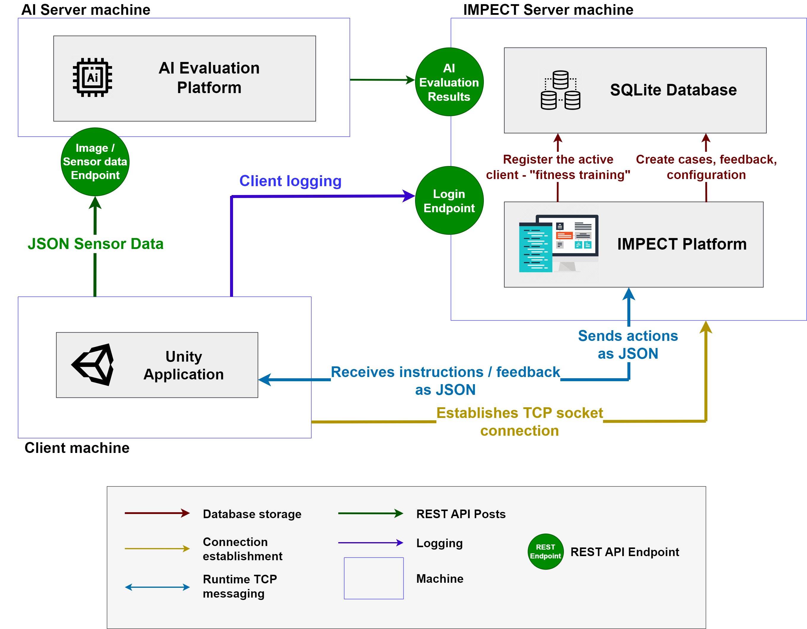
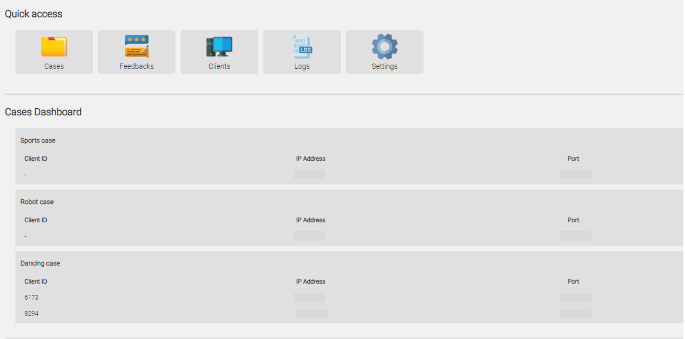
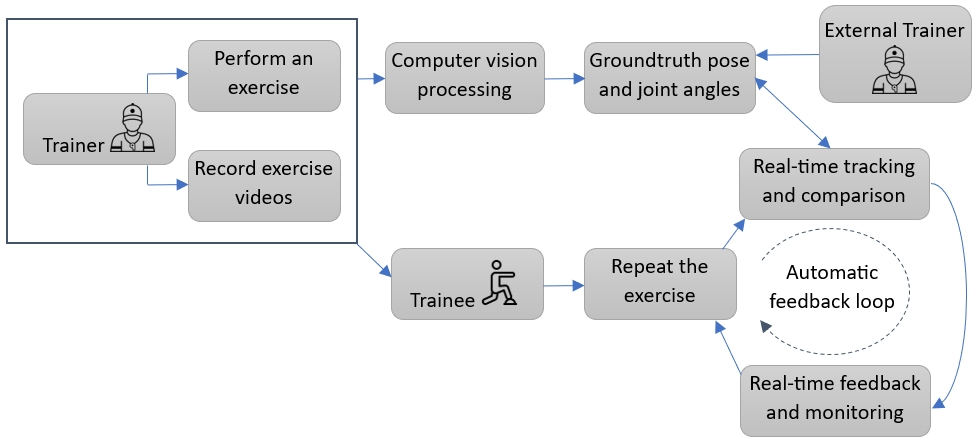
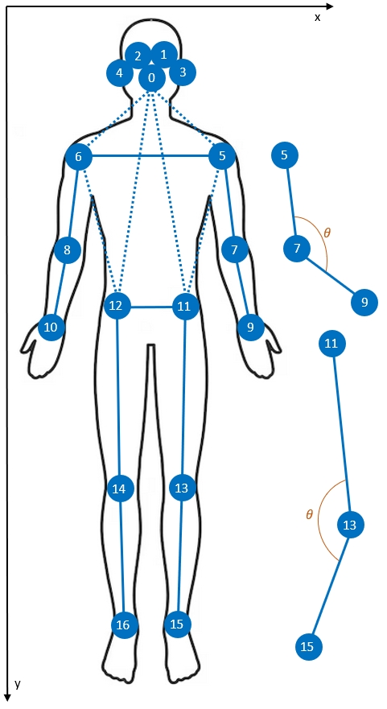

# FITSIGHT: A Computer Vision-Based Approach for Performance Analysis, Error Classification and Feedback in Gym Exercises 🏋️‍♂️

## Authors
- **Hitesh Kotte**
- **Nghia Duong-Trung**
- **Milos Kravcik**

## Project Overview

In today's world, where developing psychomotor skills poses a significant challenge, cutting-edge technology steps in as an invaluable ally. Our research introduces an innovative approach that harnesses the power of computer vision to track and enhance performance in fitness training. We present a groundbreaking system designed to monitor exercise execution and offer instantaneous feedback on posture during workouts. This real-time guidance facilitates self-correction and boosts motivation, especially in the absence of professional supervision.

Our framework is built upon advanced computer vision technology, employing the highly efficient YOLOv7-pose model to pinpoint human keypoints. This is coupled with a sophisticated tracking system focused on human body topology, providing comprehensive data for immediate posture correction. One of the standout features of our system is its use of transfer learning, which significantly reduces the need for extensive retraining of the model.

Crucially, our application, FITSIGHT, takes this innovation a step further. It enables users to employ a standard webcam as a virtual fitness trainer. This feature is particularly valuable in situations where a physical trainer is unavailable due to various constraints. FITSIGHT stands as a testament to the potential of technology in bridging the gap in physical training, providing users with a reliable and sophisticated tool for self-guided fitness journeys.

## Publications

This project has been featured in the following publications:

1. **FitSight: Tracking and Feedback Engine for Personalized Fitness Training**  
   - Authors: Hitesh Kotte, Florian Daiber, Miloš Kravčík and Nghia Duong-Trung
   - Conference: UMAP 2024: In Proceedings of the 32nd ACM Conference on User Modeling, Adaptation and Personalization, July 1–4, 2024, Cagliari, Italy.   
   - [Link to Publication](https://doi.org/10.1145/3627043.3659547)
  
2. **IMPECT-POSE: A Complete Front-end and Back-end Architecture for Pose Tracking and Feedback**  
   - Authors: Abhishek Samantha, Hitesh Kotte, Patrick Handwerk, Khaleel Asyraaf Mat Sanusi, Mai Geisen, Miloš Kravčík, and Nghia Duong-Trung
   - Conference: In Proceedings of the 32nd ACM Conference on User Modeling, Adaptation and Personalization, July 1–4, 2024, Cagliari, Italy. 
   - [Link to Publication](https://doi.org/10.1145/3631700.3664865)

3. **Augmented Intelligence in Tutoring Systems: A Case Study in Real-Time Pose Tracking to Enhance the Self-learning of Fitness Exercises**  
   - Authors: Nghia Duong-Trung, Hitesh Kotte and Miloš Kravčík
   - Conference: 18th European Conference on Technology Enhanced Learning, EC-TEL 2023 Aveiro, Portugal, September 4–8, 2023 Proceedings
   - [Link to Publication](https://link.springer.com/chapter/10.1007/978-3-031-42682-7_65)

4. **Real-Time Posture Correction in Gym Exercises: A Computer Vision-Based Approach for Performance Analysis, Error Classification and Feedback**  
   - Authors: Hitesh Kotte, Miloš Kravčík and Nghia Duong-Trung
   - Conference: MILeS’23: 18th European Conference on Technology Enhanced Learning (ECTEL2023),
     3rd International Workshop on Multimodal Immersive Learning Systems, September 04–08, 2023, Aveiro, Portugal.   
   - [Link to Publication](https://ceur-ws.org/Vol-3499/paper9.pdf)


## Master Thesis

This project was also submitted as a Master thesis:

1. **Augmented Intelligence in Tutoring Systems: Real-Time Pose Tracking to Enhance the Self-learning of Fitness Exercises**  
   - Authors: Hitesh Kotte
   - Supervisor: Dr. Florian Daiber
   - Reviewers: Prof. Dr. Antonio Krüger and Dr. Nghia Duong-Trung
   - Submitted To: Data Science and Artificial Intelligence department, Saarland University, Germany.  


## Screenshots

<table>
  <tr>
    <td colspan="2" align="center">
      <br>
      <p>Real Time Feedback</p>
    </td>
  </tr>
  <tr>
    <td>
      <br>
      <p>Impect Platform Architecture</p>
    </td>
    <td>
      <br>
      <p>Impect Dashboard</p>
    </td>
  </tr>
  <tr>
    <td>
      <br>
      <p>Fitsight Workflow</p>
    </td>
    <td>
      <br>
      <p>Human Keypoints</p>
    </td>
  </tr>
</table>


     
### Demo 🏋️‍♂️
<p align="left">
  <a href="https://github.com/hiteshkotte/MILeS_2023/assets/35593884/7835485c-a494-40b1-826d-0bdde969e541">Demo Video</a>
</p>


# 🚀 How to Run

## Setting Up the Virtual Environment 🛠️

### Prerequisites 📋
- Ensure you have [Anaconda](https://www.anaconda.com/products/individual) installed to manage your environments and packages.
  
- Clone the project repository from GitHub. Run the following command in your terminal:
  ```bash
  git clone https://github.com/hiteshkotte/DFKI-fitsight.git

After cloning, extract the project files to your desired location. Ensure that you have sufficient permissions in the directory where you wish to extract the files.

### Creating and Activating the Virtual Environment 🌐

1. **Create a Virtual Environment:**
   - Open Anaconda Prompt.
   - Run the following command to create a new virtual environment named `fitsight`:
     ```bash
     conda create -n fitsight
     ```

2. **Activate the Virtual Environment:**
   - Activate the `fitsight` environment by executing:
     ```bash
     conda activate fitsight
     ```

3. **Install Required Packages:**
   - Ensure that the `fitsight` environment is activated.
   - Change your current directory to the `DFKI-fitsight` folder, which is your working directory. Run the following command:
     ```bash
     cd path/to/your/downloads/DFKI-fitsight
     ```
   Replace `path/to/your/downloads/DFKI-fitsight` with the actual path where the `DFKI-fitsight` folder is located on your machine.
   - Install the required packages by running:
     ```bash
     pip install -r requirements.txt
     ```
     
4. **FFmpeg Installation:**
   FFmpeg is required for handling multimedia files.

   - **Using Anaconda Powershell:**
     - Run the following command to install FFmpeg:
       ```bash
       conda install -c conda-forge ffmpeg
       ```

   - **For Non-Anaconda Environments:**
     - Download and extract the [FFmpeg](https://ffmpeg.org/download.html) build to the working directory.
       
     - Add the path of the extracted FFmpeg `bin` folder to your system's PATH:
	    - Locate the `bin` folder inside the extracted FFmpeg directory.
	    - Copy the full path to this `bin` folder.
	    - Add this path to your system's PATH:
	     
     - Add FFmpeg to your system's PATH:
       - For all users:
         ```bash
         setx /M PATH "%PATH%;your_path"
         ```
       - For the current user:
         ```bash
         setx PATH "%PATH%;your_path"
         ```
     - In this version, "your_path" should be replaced by the user with the actual path to the FFmpeg `bin` directory. The command updates the PATH environment variable, making FFmpeg accessible from anywhere in the command line interface.


5. **Run the Application:**
   - Start the application by running the following command in your terminal or command prompt:
     ```bash
     python app.py
     ```
   - Once the application is running, open your web browser.
   - Navigate to the local host address provided in the application's output. Typically, this will be `http://localhost:PORT`


6. **Accessing the Application in the Browser:**
   - When you open the application in the browser, it will prompt you for credentials.
   - Use the following 🗝️Login Credentials:
     - **Username:** admin
     - **Password:** admin

   This will grant you access to the application's features. 


## Additional Information

### Input Videos for Exercises

To access the input videos used for exercise analysis, please visit the following Google Drive link:

[Exercise Videos](https://drive.google.com/drive/folders/10dz-wZCnio7Sub48rYiIDp3Gb_mW_Fq-?usp=sharing)

These videos are essential for testing and demonstrating the functionalities of the application. Ensure you have appropriate permissions to access this content.


